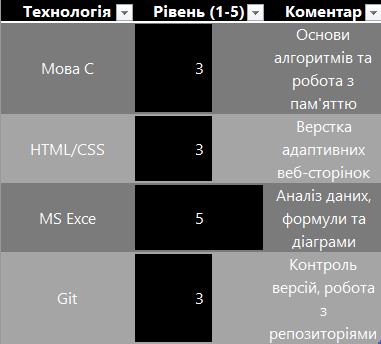

# Про мене

Я — технічний фахівець, що розвивається у сфері розробки програмного забезпечення та інформаційних технологій. Моя мета — створювати якісні цифрові продукти та ефективно документувати процеси розробки.

## Ключові компетенції

Нижче наведено перелік технологій та навичок, з якими я працюю:

* **Програмування:** Володіння мовою **C** (базові алгоритми, робота з пам’яттю та структурами даних).
* **Веб-розробка:** Створення структури та стилізація інтерфейсів за допомогою **HTML5** та **CSS3**.
* **Офісні пакети:** Експертне володіння **MS Excel** (аналіз даних, складні формули) та **MS PowerPoint**.
* **Docs as Code:** Написання технічної документації у форматі **Markdown**, робота з **MkDocs** та версіонування через **Git/GitHub**.
* **Візуалізація:** Проєктування схем та діаграм у **diagrams.net**.

---

## Рівень володіння технологіями

Для візуалізації мого поточного прогресу я підготував порівняльну таблицю в **MS Excel**. Вона відображає оцінку моїх знань за 5-бальною шкалою та містить коментарі щодо практичного досвіду.

> **Примітка:** Ця таблиця створена в Excel як частина лабораторної роботи для демонстрації інтеграції офісних інструментів у технічну документацію.

---

## Контакти та ресурси
* **GitHub:** [Мій профіль](https://github.com/Turahent862)
* **Проєкти:** Ознайомитися з моїми роботами можна у відповідному розділі цього сайту.